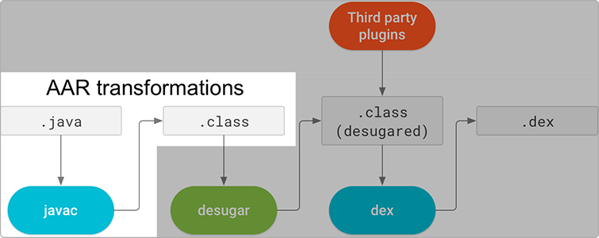



Why write an SDK for Android? Or, said another way, why not just use the
existing Azure SDK for Java on Android? The matter comes down to two issues
which would significantly hamper adoption of our SDK: technical restrictions
that limit the number of devices capable of running the Java SDK, and
mobile-specific constraints that the Java SDK doesn't optimize for.

## Java 8 code in the Java SDK is incompatible with older devices

The Java SDK uses modern (Java 8+) features, in both first-party code as well as
dependencies such as Project Reactor. For Android, full support for Java 8+ code
exists only from Android API level 24 and higher[^1]. Prior to that, only
partial support for Java 8+ language features exists.

As of February 2020, Google reports that 57.9% of devices are running a version
of Android that will support Java 8+ code[^2]. Due to this slow adoption rate,
most Android developers are unwilling to set a minimum API level of 24+ for
their applications, because they would in effect be closing themselves off from
42.1% of their potential customer base.

A new feature in Android Studio 4.0 called library desugaring will allow
applications to use Java 8+ APIs on older devices[^3]. Unfortunately, as of
February 2020 Android Studio 4.0 is only in the Canary (alpha) stage and isn't
expected to GA until sometime in 2021[^4].

A compounding problem is that the decision to use Android Studio 4.0's library
desugaring feature isn't ours as to make as library authors. When an Android AAR
library is built, only the compilation from Java source files to class files is
done:

{:style="display: block; margin: 0 auto"}

Plugins such as the one that implements desugaring are run during the dexing
process, and dexing doesn't occur until the the final Android application is
built on the customer's machine. Customers building applications with a minimum
API level below 24 would need to be using Android Studio 4.0 and have the
project-wide library desugaring feature enabled in order to use our libraries.

Development teams tend to upgrade both their build toolchain and Android Studio
at the same time, in roughly bi-yearly cycles[^5]. This means that if the
assumptions about the release date of Android Studio 4.0 are accurate, we can
expect some early adopters to begin using it in 2021, but it could take until
2023 until most development teams are using a toolchain that enables them to use
our libraries in applications with a minimum API level below 24.

## The Java SDK's async API doesn't meet the needs of Android developers

Android applications are subject to many constraints on factors including
application size (both in disk utilization and code objects such as the total
number of methods and classes that the app contains), power utilization, and
network utilization, among others. Due to these constraints, developers tend to
follow a conservative approach to selecting dependencies. A good dependency must
not only solve a problem the developer has (as well or better than the developer
themself could solve it), but it must not add significantly to the application's
total on-disk size (which would lead to long app download times and significant
use of limited on-device disk space), must not unnecessarily inflate the
application's class and method count (both of which have a hard limit imposed by
the Android app runtime, though it is possible to hack around this limit at the
cost of additional build and packaging complexity), and must make judicious use
of both battery power (apps that drain a user's battery will be quickly
discarded) and network activity (likewise, apps that quickly consume a user's
limited data plan).

Any SDK we ship for Android must meet these criteria, otherwise app developers
will be unlikely to use it. Unfortunately, our Java SDK as it is currently
designed is unlikely to appeal to developers on at least a few of these metrics.
This is largely due to the size of the dependencies the Java SDK has, the
largest contributor of which is Project Reactor. In order to ship an async-first
API, our Java SDK chose to use the reactive async programming model with Reactor
as its async framework. This might be justifiable on Android if developers found
reactive async APIs valuable, but we don't believe this is the case.

Android makes it easy for developers to perform asynchronous work explicitly,
mostly without having to deal with the complexities of threading. A developer
can simply call a synchronous API within an `AsyncTask`, run it in a foreground
or background `Service`, or hand it off to the operating system to be completed
eventually via the `JobScheduler`. They will be notified of completion (and
other events, as appropriate) via a callback, provided in the form of an
anonymous class containing event handlers.

Importantly, the developer is able to select which of these async execution
mechanisms is the most appropriate to use when calling the API, given the
context in which it's being called. The best mechanism to use in any given
context will depend on a variety of factors that the developer considers in
order to balance concerns such as interactive performance, latency, and power
utilization. What's more, the Android OS forces developers to think about the
context in which that their code is running because certain "bad behaviors" such
as running a network operation on the main (UI) thread will cause the
application to crash[^6]. Because of this, even novice Android developers tend
to understand how and when to run operations asynchronously in their
applications.

More recently, Google introduced the `LiveData` observable class[^7], and many
of Google's APIs have begun providing methods that return a `LiveData` instance
rather than requiring the developer to provide a callback. As this pattern gains
traction within the Android community, third party libraries have begun adopting
it in their APIs as well. However this change is mostly for the benefit of
developer ergonomics - internally, the libraries still execute work off the main
thread using one of the above methods, but they then wrap the complexity of
callbacks and provide a `LiveData` instance back to the consumer that can be
used to observe state changes.

Most Android developers don't appear to have a general understanding of reactive
programming concepts beyond what's needed to interact with `LiveData`[^8],
perhaps because neither the Android standard library itself nor Google's Jetpack
SDK includes a reactive async framework (aside from the `LiveData` observable
itself). Thus, any library that wanted to provide true reactive async APIs would
have to declare a dependency on an existing third-party reactive framework such
as RxJava or Reactor. These third-party frameworks would then fall under the
same level of scrutiny described above, and many developers would decide that
the impact adding such a framework would have in terms of application and code
size isn't worth the convenience of having a reactive async API.

The attitude towards providing and consuming true async APIs on Android is
changing, however. The Android community, following the lead of Google, is
moving towards writing new code in the Kotlin language rather than in Java.
Kotlin includes first-class support for asynchronous work via coroutines[^9],
rather than adopting the reactive pattern. Coroutines compose well with and
compliment both `LiveData` and the callback-based async model that developers
are used to from Java. This means that as support for and use of Kotlin grows
within the ecosystem, there will be an easy transition for developers who are
used to consuming synchronous APIs in Java, into a world where first-class
asynchronous APIs are available based on Kotlin coroutines. This has an added
benefit that coroutines are easy for developers to learn and use, and it's
likely that they have encountered them before in other popular languages such as
C#, JavaScript, and Python.

All of the above said, there are rare occasions where we do see Android
developers using a reactive async framework in their applications. In these
circumstances, Android developers almost exclusively choose RxJava over Reactor
because it's been officially supported on Android since its first release[^10]
and provides the Android-specific code needed to integrate RxJava with Android
apps[^11]. Additionally, when RxJava's developers decided to begin using Java 8+
language features in RxJava 3.0, they did so carefully such that only the subset
of Java 8 features which are supported on all Android devices are used[^12]. In
contrast, Reactor isn't officially supported on Android[^13], though the
developers note that it should work on devices with an API level of 26+. The
project is also missing the Android-specific code needed to integrate Reactor
with Android apps, though we have experimentally proven that it would be easy to
ship our own version of such code within our SDK.

All concerns about minimum API level aside, it's clear that if a customer were
to be using a reactive async framework today (which we know is very uncommon),
there is nearly complete certainty that they're using RxJava rather than
Reactor. This means that in either case, adding our Java SDK to their
application would force the developer to bring in all of Project Reactor as
well, providing little to no benefit in the process since we don't believe they
will see reactive async APIs as providing any benefit. Furthermore, given that
Google is in the process of bringing a first-class async programming model to
Android in the form of Kotlin coroutines, and Java-based projects are moving
towards simplifying their existing callback-based code with `LiveData`, we
believe that the small population of Android developers using reactive async
frameworks today will be looking to move away from them and towards these
first-class offerings in the future.

---
[^1]: [Use Java 8 language features](https://developer.android.com/studio/write/java8-support)
[^2]: [Distribution dashboard](https://developer.android.com/about/dashboards/)
[^3]: [New features in Android Studio Preview: Java 8 library desugaring in D8 and R8](https://developer.android.com/studio/preview/features#j8-desugar)
[^4]:
    Android Studio 3.6 is expected to GA in the first half of 2020 - it entered
    RC3 on 2/10, and both previous versions have had a delay of less than one
    month between RC3 and GA[^14].

    Android Studio 4.0 would be the next release after 3.6, as it's already in
    the Canary (alpha) stage. It's possible that it could GA in the second half
    of 2020. The previous major release took roughly six months to move from its
    first Canary release to GA[^15].

    Given the large number of sweeping new features in Android Studio 4.0 and
    the fact that Google has adpoted a strategy of moving more slowly and
    incrementally in its recent Android Studio releases, it's likely that the
    timeline for Android Studio 4.0 will extend into 2021[^16].

[^5]: ["What's New in Android Development Tools" Google I/O 2019](https://www.youtube.com/watch?v=8rfvfojtRss)
[^6]: [NetworkOnMainThreadException](https://developer.android.com/reference/android/os/NetworkOnMainThreadException)
[^7]: [LiveData Overview](https://developer.android.com/topic/libraries/architecture/livedata)
[^8]:
    A group of 40 professional Android developers was polled with the question,
    "How many people understand reactive streams?". Only one developer responded
    in the affirmative. However, most developers were familiar with
    callback-based async and `LiveData` observables.

[^9]: [Improve app performance with Kotlin coroutines](https://developer.android.com/kotlin/coroutines)
[^10]: [RxJava: Reactive Extensions for the JVM](https://github.com/ReactiveX/RxJava/blob/v1.0.0/README.md)
[^11]: [RxJava bindings for Android](https://github.com/ReactiveX/RxAndroid)
[^12]: [RxJava: Reactive Extensions for the JVM: Version 3.x](https://github.com/ReactiveX/RxJava#version-3x-javadoc)
[^13]: [Reactor 3 Reference Guide: Prerequisites](https://projectreactor.io/docs/core/release/reference/index.html#prerequisites)
[^14]: [Android Studio 3.6 Release Candidate 3 available](https://androidstudio.googleblog.com/2020/02/android-studio-36-release-candidate-3.html)
[^15]: [Android Studio 3.0 now available](https://androidstudio.googleblog.com/2017/10/android-studio-30-now-available.html)
[^16]: ["What's New in Android Studio" Android Dev Summit 2019](https://www.youtube.com/watch?v=XPMrnR1_Biw)



